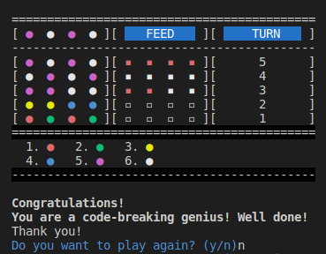

Show your love by giving a :star:!
# Mastermind Game

**Mastermind** is a code-breaking game for two players. The first player, the code-maker, chooses a secret code of four colored pegs. The second player, the code-breaker, tries to guess the code in a few turns as possible. The code-maker gives the code-breaker feedback after each guess, indicating how many of colors in the guess are correct and how many are in the correct position. The code-breaker uses this feedback to try to guess the code again. The first player to guess the code correctly wins the game.



## Files
- [**mastermind.rb**](./mastermind.rb): This file contains modules and methods for the Mastermind game. It includes modules for providing constants, counting the number of pegs, displaying instructions and messages to the user, and validating user input.
- [**player.rb**](./player.rb): This file contains two classes `HumanPlayer` and `ComputerPlayer` which are used to represent the players of the game Mastermind. Both classes include methods for creating and guessing codes, as well as validating inputs.
- [**board.rb**](./board.rb): This file contains the implementation of the `Board` class that is responsible for drawing, reading, and writing the game board for the Mastermind game.
- [**game.rb**](./game.rb): This file contains the implementation of the Game class that provides methods for running the game, setting up code-maker and codebreaker, checking if the game is over, and giving feedback on the guesses.
- [**main.rb**](./main.rb): This file defines a class called PlayMastermind which creates a new instance of the game and starts it.

## Features
- **Two game-play modes**: Players can choose to play as either the code-maker or codebreaker. In the code-maker mode, the player creates a secret code and the computer tries to guess it. In the codebreaker mode, the computer creates a secret code and the player tries to guess it.
- **Feedback system**: The game provides feedback on each guess, letting players know how many pegs they got right and how many were in the correct position.

## How to play
1. Choose a role. You can either be the code-maker or the codebreaker.
2. If you are the code-maker, create a secret code. You can use any four colors from the set of six.
4. If you are the codebreaker, make your first guess.
5. You will get feedback on your guess.
6. Make another guess.
7. Continue guessing until you break the code or run out of turns.
8. If you break the code, you win!
9. If you run out of turns, the code-maker wins!

**Now is the time to play.** :video_game:
1. Clone the repository to your local machine and navigate to the root directory of the game
    ```ruby
    $ git clone https://github.com/saleamlack/mastermind.git
    ```
2. Run the `main.rb` to start the game
    ```ruby
    $ ruby main.rb
    ```
3. Follow the instructions displayed in the terminal to play the game

## live Demo
[Mastermind](https://replit.com/@Saleamlack/mastermind?v=1)